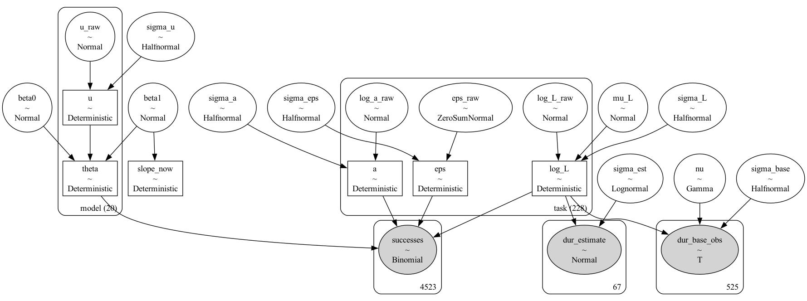

# Measurement-error model for METR's time horizon

A Bayesian extension of Jonas Moss's [IRT reanalysis](https://www.lesswrong.com/posts/sBEzomgnYJmYHki9T) of METR's [time-horizon data](https://github.com/METR/eval-analysis-public), adding an explicit measurement-error layer for human baseline task timing. Moss's model treats each task's human time as a fixed, exactly-known scalar; this model treats it as a latent variable informed by the per-run timing data, plus a residual difficulty term ($\varepsilon_i$) that absorbs whatever task-difficulty variance isn't explained by length.

For every number and plot behind the headline results, see [`docs/results.md`](docs/results.md).

## Setup

This repo expects two sibling checkouts next to it (same parent directory), used as the raw data source and as a read-only reference implementation:

```
some-parent-dir/
  metr-measurement-error/       # this repo
  eval-analysis-public/         # git clone https://github.com/METR/eval-analysis-public
  metr-stats/                   # git clone https://github.com/JonasMoss/metr-stats
```

Then, from inside this repo:

```
uv sync
uv run python data/load_runs.py
```

## Repo layout

```
data/
  load_runs.py          # filters runs.jsonl down to human timing observations
  processed/             # output of load_runs.py (gitignored)
models/
  data_prep.py           # assembles filtered human data + full runs.jsonl + release
                         # dates into the arrays the PyMC model needs
  time_horizon_model.py  # pm.Model builder: measurement layer + IRT layer + trend
                         # (4 trend shapes, optional Student-t measurement layer)
scripts/
  fit_model.py           # runnable fit script (nutpie, falls back to PyMC NUTS);
                         # --shape {linear,kink,superexp,logistic}, --robust,
                         # --log-likelihood (pointwise, for stacking),
                         # --sota-only (METR's frontier model set, see docs/results.md)
  analyze_fit.py         # PPCs, per-model 50% horizons, doubling time
  compare_robust.py      # Normal vs Student-t before/after comparison
  compare_duration_dists.py  # PSIS-LOO of lognormal vs Student-t vs Weibull on the
                         # 525 baseline runs (Jacobian-corrected to a common scale)
  sbc.py                 # reduced-scale simulation-based calibration
  stack_shapes.py        # PSIS-LOO + Bayesian stacking across the 4 shapes
  make_figures.py        # generates outputs/figures/*.png from the fitted .nc files
  marginal_horizon.py    # marginal (METR-style) vs conditional exp(theta) horizon
  measurement_value.py   # what the measurement layer buys (uncertainty vs plug-in)
  compare_measurement.py # baseline vs heteroscedastic vs failed-run censoring
  make_measurement_figures.py  # figures for the measurement-error experiments
outputs/                 # saved InferenceData (.nc), gitignored
outputs/figures/         # generated plots (committed, see docs/results.md)
docs/
  results.md             # full results: every number and plot
  red_team_review.md     # structural critique / shortcomings
  measurement_error_improvements.md  # experiments + recommended best model
```

## Data

Source: METR's public `eval-analysis-public` repo,
`reports/time-horizon-1-1/data/raw/runs.jsonl` (24,008 rows, one row per
model-task run, each carrying the task's human timing metadata).

Human timing observations are the rows with `model == "human"`: the
people who attempted (or, for a few tasks, estimated) each task's
duration. Every other row is a model's own run carrying that task's
human-timing metadata along for reference.

`data/load_runs.py` filters to:

```
model == "human"  AND  score_binarized == 1  AND  completed_at > 0
```

On the current snapshot this yields 554 rows / 164 distinct tasks (525
`human_source == "baseline"`, 29 `"estimate"`). `models/data_prep.py` then
builds the observation set from this. Two properties of the data shape
the observation model (both verified against the snapshot):

1. `human_minutes` is a task-level annotation. It
   is identical on every row of a task (0 of 136 multi-row tasks vary) and
   equals the geometric mean of successful baseline wall-times where those
   exist (median ratio 0.998). The per-run observation is wall-clock time,
   `(completed_at - started_at)` (run-relative millisecond clocks). Within-
   task sd of log wall-time is ~0.4-0.6 (i.e., 1.5-2x). Feeding
   `human_minutes` per-row as if independent made `sigma_base` collapse to
   0 and froze the sampler.
2. The task universe is all 228 tasks models attempted (only 164 have
   successful human runs). The 64 otherwise-dropped tasks are almost
   all estimate-source and skew long (up to 30h); dropping them biases the
   trend. Tasks with no timed baseline run contribute their annotation as
   a single "estimate" observation.

Final observation set: **525 per-run baseline wall-times + 67 task-level
estimate annotations, over 228 tasks**. Estimate-source tasks with human
runs (RE-Bench 8h time-boxed runs) do have wall-clock times, but those are
budget-limited working times; only the annotation is used for them.

Run it:

```
uv run python data/load_runs.py
```

```
Loaded 24008 raw rows from .../runs.jsonl
Filtered (score_binarized==1 & completed_at>0): 554 rows / 164 tasks (136 tasks with >=2 timed attempts)
  baseline (real-timed) rows: 525, estimate-only rows: 29
Wrote filtered data to data/processed/runs_filtered.parquet
```

Censoring note: the v2 spec calls for right-censoring duration observations
at `time_limit` for RE-Bench-style runs that stack at the limit, and the
`pm.Censored` branch in `time_horizon_model.py` implements it. In the
current `runs.jsonl` snapshot, `time_limit` is always `0` for
`model == "human"` rows (that field is populated for agent compute
budgets), so no row is censored; the branch activates automatically if a
future data pull includes time-limited human runs.

`models/data_prep.py` additionally pulls:
- IRT counts: for every (model, task) pair among the 228 tasks (all
  non-human, non-cloned models), attempt/success counts aggregated from the
  full `runs.jsonl` (4,523 (model,task) rows across 20 models on this
  snapshot).
- Release dates: from `../metr-stats/data/release_dates.json`, plus
  overrides in `models/data_prep.py` for the two models missing there
  (`flamingo_2` == GPT-5.3-Codex and `claude_opus_4_6_inspect`, both
  2026-02-05, sourced from METR's TH1.1 `logistic_fits/headline.csv` via
  the runs.jsonl `alias` column). All 20 models are dated and participate
  in the trend. A model without a date would contribute no trend term,
  its ability captured purely by the random effect `u_m`.

## Model

See the docstring at the top of `models/time_horizon_model.py` for the full
spec. This extends Moss's 2PL model with a residual-difficulty
term, a different identification fix suited to our difficulty scale, and
a per-model random effect on ability.

- Measurement layer: $\log(L_i) \sim \mathcal{N}(\mu_L, \sigma_L)$; baseline
  observations $\log(\text{dur}) \sim \mathcal{N}(\log(L_i), \sigma_{\text{base}})$ (censored where
  applicable); estimate-only observations $\log(\text{rep}) \sim \mathcal{N}(\log(L_i), \sigma_{\text{est}})$
  with a wider prior on $\sigma_{\text{est}}$ (median 1.25, calibrated
  to Barry's 60%-within-3x finding), reflecting that
  expert estimates are less reliable than a real timed run.
- IRT layer: $\text{logit}\, P(\text{success}_{im}) = a_i \left(\theta_m - (\log(L_i) + \varepsilon_i)\right)$,
  with $a_i \sim \text{LogNormal}(0, \sigma_a)$ and the residual-difficulty
  term $\varepsilon_i \sim \text{ZeroSumNormal}(\sigma_\varepsilon)$.
  The sum-to-zero constraint is the identification fix for a shift
  non-identifiability between $\varepsilon_i$ and $\theta_m$ that a free
  $\sigma_\varepsilon$ can't resolve on its own.[^1] Moss avoids this by
  hard-anchoring two $\theta$ values ($\theta_{\text{low}}=-1$, $\theta_{\text{high}}=+1$); that
  doesn't work here because our difficulty scale is pinned in log-minute
  units by the timing data, and anchors would break the log-minute
  interpretation of $\theta_m$ ($h_{50,m} = \exp(\theta_m)$).
- Ability trend: $\theta_m = f(t_m) + u_m$ for dated models, $\theta_m = \beta_0 + u_m$
  for undated models, with $u_m$ a per-model random effect that lets the
  doubling-time CI reflect model-to-model variation. $f(t_m)$ is one of
  four fitted shapes (linear, $\beta_0 + \beta_1 t_m$, is the simplest case;
  kink, superexponential, and logistic are the other three, combined via
  Bayesian stacking).
- All group-level latents ($\log L$, $\varepsilon$, $u$, named `log_L`,
  `eps`, `u` in code) use a non-centered parameterization. With only
  1-2 observations for most tasks, a centered $\log L \sim \mathcal{N}(\mu_L, \sigma_L)$
  produces a funnel between $\sigma_L$ and $\log L$.

Below is the model graph, generated with `pm.model_to_graphviz()` from the
built model (Student-t duration likelihood, linear shape). Rectangles are
deterministic nodes (the non-centered reparameterizations, `theta`, `a`,
`eps`, `log_L`), circles are free random variables, shaded circles are
observed. The three plates on the right give the observation counts: 4,523
(model, task) success/attempt pairs, 67 estimate-only annotations, 525
timed baseline runs. The `task (228)` and `model (20)` plates show which
latents repeat per task and per model.



## Running

```
uv run python scripts/fit_model.py                      # tiny smoke test (200 tune/200 draws/2 chains, nutpie)
uv run python scripts/fit_model.py --tune 2000 --draws 2000 --chains 4 --target-accept 0.95 \
    --shape kink --robust --log-likelihood              # production-style fit of one shape
uv run python scripts/fit_model.py --sampler pymc        # force PyMC's own NUTS

uv run python scripts/fit_model.py --tune 2000 --draws 2000 --chains 4 --target-accept 0.95 \
    --duration-dist weibull --log-likelihood         # Weibull duration layer

uv run python scripts/fit_model.py --tune 2000 --draws 2000 --chains 4 --target-accept 0.95 \
    --shape kink --robust --log-likelihood --sota-only   # METR's 14 SOTA models only

# Measurement-error improvements (see docs/measurement_error_improvements.md):
uv run python scripts/fit_model.py --tune 2000 --draws 2000 --chains 4 --target-accept 0.95 \
    --shape kink --robust --heteroscedastic --log-likelihood   # recommended best model
uv run python scripts/fit_model.py --tune 2000 --draws 2000 --chains 4 --target-accept 0.95 \
    --shape linear --robust --include-human-failures --log-likelihood  # survivorship sensitivity
uv run python scripts/marginal_horizon.py --fit outputs/fit_linear_robust.nc
uv run python scripts/measurement_value.py --fit outputs/fit_linear_robust.nc
uv run python scripts/compare_measurement.py --fits outputs/fit_linear_robust.nc \
    outputs/fit_linear_robust_het.nc outputs/fit_linear_robust_hf.nc
uv run python scripts/sbc.py --shape kink --robust --sigma-est-median 1.25 --n-reps 40  # headline-config SBC

# Robustness-check scripts:
uv run python scripts/compare_robust.py --normal outputs/fit_linear.nc --robust outputs/fit_linear_robust.nc
uv run python scripts/compare_duration_dists.py \
    --fits outputs/fit_linear.nc outputs/fit_linear_robust.nc outputs/fit_linear_weibull.nc \
    --duration-dists lognormal studentt weibull --sigma-est-medians 0.8 0.8 0.8
uv run python scripts/sbc.py --n-reps 50 --tune 800 --draws 500
uv run python scripts/stack_shapes.py --fits outputs/fit_linear_robust.nc outputs/fit_kink_robust.nc \
    outputs/fit_superexp_robust.nc outputs/fit_logistic_robust.nc

uv run python scripts/make_figures.py   # regenerates outputs/figures/*.png from the .nc files below
```

## Headline results

Full detail, every plot, and the comparison against METR's and Moss's numbers: [`docs/results.md`](docs/results.md).

- Stacked doubling time (current): **2.8 months [2.3, 3.8]**
- Residual task-difficulty spread at fixed length (`sigma_eps`): ~8x
- SBC (reduced scale): pass, 50/50 reps, well-calibrated
- Weibull duration likelihood tested (Moss's suggestion): rejected, worse fit than Student-t/log-normal
- `sigma_est` prior recalibrated to Barry's 60%-within-3x finding: headline robust to the shift

## Open work

- SBC at the robust (Student-t) variant and at full data scale.
- An explicit marginal-vs-conditional horizon comparison against METR's
  definition ($\sigma_\varepsilon \approx 2.2$ log-minutes makes the two differ a lot, and
  extrapolations are sensitive to which one you mean).
- Prior-sensitivity pass on the shape-specific priors (t_k, h, s); the
  sigma_est pass is done (headline insensitive to a 0.8 -> 1.25
  prior-median shift).
- Rerun SBC under the recalibrated sigma_est prior (the SBC table in
  `docs/results.md` used the original median-0.8 prior).

[^1]: Only $\theta_m - (\log(L_i) + \varepsilon_i)$ enters the logit, so adding a
    constant to every $\varepsilon_i$ and subtracting it from every $\theta_m$ leaves
    the likelihood unchanged. The mean-zero prior on $\varepsilon$ only weakly
    penalizes this shift, producing a near-flat ridge in the posterior.
    The sum-to-zero constraint removes the degree of freedom directly.
