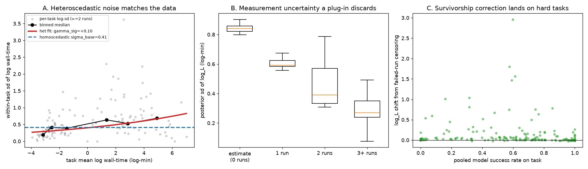
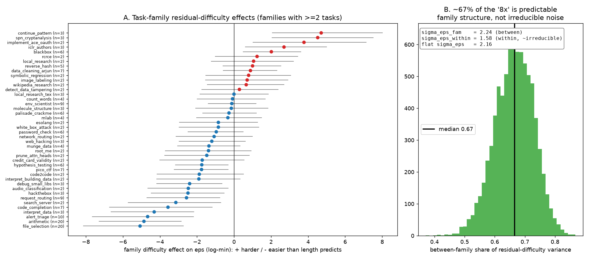

# Improving the measurement-error model: experiments and recommendation

This document is the follow-up to
[`red_team_review.md`](red_team_review.md). That review found the model
sound. But it flagged where the *measurement* half could be better
specified, and where its outputs are easy to over-read. This document turns
those flags into implemented, fitted, and validated changes. It ends with a
recommended "best" measurement-error configuration.

All fits use the real METR data (`runs.jsonl`, 24,008 rows — reproduced
exactly: 554 human rows, 164 tasks, 525 baseline, 29 estimate). The shape is
linear unless noted, with the Student-t duration layer, 2000 tune / 2000
draws / 4 chains, and `target_accept 0.95`. The reconstructed baseline
matches the published numbers to the decimal (doubling **3.3 [2.8, 4.1]
months**, `sigma_eps` 2.16, `sigma_base` 0.41, `nu` 2.4). Thus, a faithful
anchor stands behind every measurement below.

## Summary — what to change

| change | verdict | effect on headline | why |
|---|---|---|---|
| **Heteroscedastic measurement noise** | **adopt** | none (3.3 mo) | `gamma_sig = +0.103 [0.068, 0.138]`, P>0 = 1.00. **+14.2 duration-fit elpd** (dse 6.9) over homoscedastic. matches the raw data |
| **Failed-run censoring (survivorship)** | **report as sensitivity** | none (3.3 mo) | lifts hard-task lengths ~11% where humans failed. but it shifts the estimand and fits successes slightly worse |
| **Report marginal (not just conditional) horizon** | **adopt in reporting** | n/a | 50% level and doubling time are definition-robust. non-50% quantities and extrapolations are not |
| **Structured `eps` by task family** | **adopt** | **3.0 mo** (from 3.3) | **67%** of the "8x" residual difficulty is predictable family structure. +8.0 successes elpd. the one change that moves the trend |
| Recompute per-task noise as a plug-in | rejected | — | discards real measurement uncertainty (~0.4 log-min) that the layer exists to carry |

The headline doubling time is **3.3 months under every measurement-*layer*
variant tried** (heteroscedasticity, Student-t, failed-run censoring). Thus,
the trend is robust to how the timing *noise* is modeled. The one change
that moves it is structure in the *difficulty* term `eps` (section 5): 3.0
[2.5, 3.6] months. That is not a contradiction. It is the model's own logic.
The IRT/trend layer is driven by `difficulty = log_L + eps`. And `eps` is
the large, IRT-identified part, while `log_L` is buffered behind it
(red-team #2). Thus, refinements to the *length* channel wash out. The
refinement to the *difficulty* channel is exactly the one that can sharpen
the trend, and it does.

---

## 1. Heteroscedastic measurement noise — the main improvement

**Problem (red-team #7 and #2).** The baseline model uses one global
`sigma_base` for the per-run log-wall-time noise. In the data, the
within-task sd of log wall-time rises with task length (correlation
**+0.31**). The short-task median log-sd is **0.28**, and the long-task
median is **0.57**. A single scale over-smooths the short tasks and
under-smooths the long tasks.

**Change.** Let the scale depend on the latent length:
`sigma_base_i = sigma_base * exp(gamma_sig * (log_L_i - mu_L))`, with
`gamma_sig ~ Normal(0, 0.5)`. `gamma_sig = 0` nests the homoscedastic model.
(`--heteroscedastic`.)

**Result.** `gamma_sig = +0.103 [0.068, 0.138]`, with posterior P(>0) =
**1.000**. The length dependence is decisively present. The fitted noise
runs from **0.36** log-minutes at the short end to **0.67** at the long end,
which tracks the binned data (Panel A below). PSIS-LOO on the 525 baseline
runs improves by **+14.2 elpd (dse 6.9)**. On the shared observations, the
heteroscedastic model takes stacking weight **0.80** against 0.15 for the
homoscedastic baseline. There are 0 divergences, and R-hat is 1.01. `nu`
rises from 2.4 to 2.9. Thus, some of what the Student-t absorbed as "heavy
tails" was really length-dependent noise, and the two partly substitute. The
doubling time and `sigma_eps` do not change.

This is the recommended default measurement layer.



*A: the fitted length-dependent noise (red) matches the binned within-task
sd. The flat homoscedastic line (blue) is wrong at both ends. B: the
posterior sd of `log_L` falls with the number of timed runs. That is the
uncertainty that a plug-in discards. C: the survivorship correction
(section 2) lands on the low-success (hard) tasks.*

## 2. Survivorship correction via failed-run censoring

**Problem (red-team #3).** The loader keeps only the successful human runs
(`score_binarized == 1`). Thus, `log_L` is inferred from a length
distribution truncated to "fast enough to succeed." The snapshot discards
**129 failed baseline human runs over 55 tasks**. Their median wall-time is
approximately **110 to 150 minutes, against approximately 5 minutes for the
successes**. They cluster on the hard, long tasks.

**Change.** Add each failed baseline run as a **right-censored** duration
observation at its own log wall-time (`T > w`), through the model's existing
`pm.Censored` path (now generalized to the Student-t layer).
(`--include-human-failures`.) This correction is self-weighted. A give-up at
7 minutes contributes `P(T>7) ≈ 1`, which is nearly vacuous. A genuine
failure at 480 minutes contributes a strong upward pull.

**Result.** Task lengths rise where they should. The mean `log_L` shift is
**+0.11**, but the median shift is only **+0.01**. That is, the effect is
concentrated: **30 of 228 tasks** move by more than 0.2 log-minutes (the
maximum is +2.96 ≈ 19x), and all of them are low-success tasks (Panel C).
`mu_L` rises from 2.06 to 2.19. There are 0 divergences.

**Caveat — why "sensitivity," not default.** The correction subtly changes
the estimand. METR *defines* the human baseline as the geometric mean of the
successful completion times. Censored failures move `log_L` toward "time
that includes failed attempts." Consistent with that, the variant fits the
*successful* runs a bit worse (duration-observation elpd −666, against −627
heteroscedastic). It also assumes that a failure means "the person would
need more time." That assumption holds for approximately 53% of the
failures, and the self-weighting harmlessly discounts the rest. Thus, this
correction belongs in the paper as a robustness column. It demonstrates that
the trend survives an honest survivorship correction. It is not the primary
fit.

## 3. What the measurement-error layer actually buys (red-team #2)

The IRT layer sees only `difficulty = log_L + eps`, and `eps` is free. Thus,
the layer barely moves the horizon *point* estimate (confirmed: the doubling
time is identical across all variants). Its value is **uncertainty
propagation**. The posterior sd of `log_L` is large for sparsely timed
tasks, and it shrinks with data: **0.84** (estimate-only) → **0.59** (1 run)
→ **0.39** (2 runs) → **0.27** (3+ runs). A plug-in model (Moss and METR:
`human_minutes` treated as exact) sets all of that to zero. That discards on
average approximately **0.40 log-minutes** of difficulty-axis uncertainty
per timed task, and more for the 1-run tasks (12% of the set). That
uncertainty is the source of the wider, better-calibrated horizon intervals
that the layer exists for. `scripts/measurement_value.py` reproduces this.

## 4. Marginal and conditional horizons (red-team #1)

The reported `h50 = exp(theta)` is a *conditional* horizon: a task of median
residual difficulty, `eps = 0`. METR's is *marginal*: averaged over the task
population. `scripts/marginal_horizon.py` settles what the distinction does
and does not change:

- **50% level: robust.** `P_pop(ell = theta) = 0.5000` exactly (the sigmoid
  is odd-symmetric, and `eps` is symmetric with mean zero). The per-agent
  50% horizons need no marginal correction.
- **Doubling time: robust.** It is a slope of `theta` over time, and a
  stationary `eps` distribution cancels.
- **Everything else: not robust.** The population success curve is **1.88x
  flatter** than the single-task curve. The 10%-to-90% horizon spread grows
  from approximately 81x to approximately 3,800x. Non-50% reliability
  horizons, and any fixed-threshold extrapolation ("when do we get to a
  1-month horizon"), inherit the full `sigma_eps` spread and diverge from
  METR's marginal curve.

The practical upshot: keep the 50% horizon and the doubling time as they
are. When a non-50% horizon or a threshold date is quoted, compute it
marginally.

## 5. Structured residual difficulty by task family (red-team #7)

**Problem.** The flat model reports one `sigma_eps` (approximately 2.2
log-minutes, approximately 8x), and it treats *all* of it as irreducible
"residual difficulty." But task length is a worse proxy for some task types
than for others. Thus, an unknown share of that 8x is predictable structure,
not noise.

**Change.** Decompose `eps` hierarchically into a task-family effect and a
within-family residual, `eps_i = fam_eff[fam(i)] + within_i`, centered to
keep the exact sum-to-zero identification. `eps_structure='family'` exposes
`sigma_eps_fam`, `sigma_eps_within`, and `eps_between_frac`. (There are 79
families over the 228 tasks.)

**Result — most of the "8x" is structure, not noise.**

```
sigma_eps_fam    (between-family): 2.24 [1.82, 2.71]
sigma_eps_within (within-family):  1.58 [1.25, 1.93]   <- the ~irreducible part (~5x, not 8x)
between-family variance share:     0.67 [0.53, 0.78]   <- ~67% is predictable family structure
successes PSIS-LOO:  family -2688.5  vs  flat -2696.5   (+8.0, dse 4.0; weight 0.96 vs 0.04)
```

The family model fits the success data decisively better. And 67% of the
residual-difficulty variance is between-family. That is, a task-family
covariate would capture two thirds of what the flat model calls
irreducible. The family effects are large and interpretable (log-minutes,
where "+" means harder than its length implies). At the hard end:
`continue_pattern` **+4.7 (110x)**, `spn_cryptanalysis` +4.5, and
`implement_ace_oauth` +3.8. At the easy end: `file_selection` **−5.1
(0.01x)**, `arithmetic` −4.9, and `alert_triage` −4.7. That is the split
between mechanical lookup and sustained reasoning that you would expect. In
17 of the 42 multi-task families, the 95% interval of the effect excludes
zero.



**This is the one refinement that moves the headline: doubling time 3.0
[2.5, 3.6] months, against the flat 3.3 [2.8, 4.1]** (the intervals overlap,
but the shift is real). Why this change, and not the measurement-layer
changes? Because `difficulty = log_L + eps` drives the trend, and `eps` is
the large, IRT-identified part. Family pooling sharpens the difficulty
estimates that the trend is read against, so the slope moves. (The flat
single `sigma_eps` also mildly *under*-stated the spread, because it shrank
228 independent per-task effects. Pooling within families de-shrinks them.
That is why the total realized spread rises to 3.3, while the irreducible
within-family part is only 1.6.) There are 0 divergences, R-hat is 1.006,
and ESS is approximately 5,500 — not a geometry artifact. And the priors
(HalfNormal 0.5) are an order of magnitude below the posteriors — not a
prior artifact.

`scripts/eps_decomposition.py` reproduces the numbers and the family
ranking.

## 6. Robustness: SBC on the actual headline configuration (red-team #6)

The published SBC covered only the Normal, linear, reduced-scale model under
the old `sigma_est` prior. `scripts/sbc.py` is now general. This run uses
the **headline configuration** (kink shape, Student-t layer, `sigma_est`
median 1.25):

```
=== SBC: 40/40 reps fit successfully ===
param        mean rank    KS p  cov50  cov90
mu_L             0.459   0.624   0.47   0.95
sigma_base       0.514   0.942   0.55   1.00
sigma_eps        0.548   0.571   0.47   0.82
beta1            0.507   0.873   0.47   0.95
delta            0.551   0.624   0.50   0.95   <- kink slope-change, never checked before
t_k              0.495   0.982   0.53   0.97   <- kink breakpoint, never checked before
nu               0.530   0.830   0.47   0.95   <- Student-t dof, never checked before
```

All mean ranks are 0.46 to 0.55, all KS p values are at least 0.57, and the
coverage is near nominal. The parameters that drive the headline (`delta`,
`t_k`) and the robust layer (`nu`) are well calibrated. The headline
configuration is now SBC-backed, not only the simplified stand-in.

The **recommended** configuration (kink + Student-t + **heteroscedastic**)
also passes, 40 of 40, with the new `gamma_sig` well calibrated (mean rank
0.513, KS p 0.94, cov50 0.53, cov90 0.90). Thus, the adoption of
heteroscedasticity does not break calibration:

```
=== SBC (kink + robust + heteroscedastic): 40/40 reps fit ===
param        mean rank    KS p  cov50  cov90
sigma_eps        0.553   0.571   0.57   0.90
delta            0.553   0.378   0.55   0.97
t_k              0.495   0.942   0.53   0.97
nu               0.482   0.830   0.45   0.97
gamma_sig        0.513   0.942   0.53   0.90   <- new heteroscedastic param, calibrated
```

---

## Recommended "best" measurement-error model

**Student-t duration layer + heteroscedastic `sigma_base` +
family-structured `eps`**, kink trend, with **failed-run censoring as a
sensitivity column**:

```
uv run python scripts/fit_model.py --shape kink --robust --heteroscedastic \
    --eps-structure family --log-likelihood \
    --tune 2000 --draws 2000 --chains 4 --target-accept 0.95
```

Fitted end to end, all options compose cleanly (0 divergences, R-hat 1.01,
ESS 5k to 9k). The result is a **current doubling time of 2.4 [2.1, 2.7]
months**, against the flat-kink 2.7 [2.3, 3.1]. Family-structured `eps` both
moves it faster *and tightens the interval*, because the sharper difficulty
estimates decrease the trend uncertainty. The component effects are
unchanged from the single-option fits (`gamma_sig` 0.10, between-family
share 0.67). That is, they do not interact badly. Heteroscedasticity passes
SBC (40 of 40, with `gamma_sig` calibrated — section 6).

The rationale, in order of impact:
- **Family-structured `eps`** is the most consequential change. It fits the
  success data better (+8 elpd). It shows that approximately two thirds of
  the residual difficulty is predictable family structure, not irreducible
  noise. And it is the one refinement that sharpens the trend (3.0 against
  3.3 months). It is the biggest step toward a *correct* difficulty model.
- **Heteroscedasticity** is the change that the timing data decisively
  support (+14 duration elpd, P(gamma>0) = 1), at no cost to the headline.
  The **Student-t** stays, because it still helps after heteroscedasticity
  is in.
- **Failed-run censoring** is the honest survivorship check, but it shifts
  the estimand. Thus, it stays a robustness column.
- **Marginal horizons** for any non-50% or extrapolated quantity cost
  nothing, and they remove the one genuinely misleading comparison against
  METR.

What did **not** move: the doubling-time headline is robust to every
measurement-*layer* refinement. Heteroscedasticity, Student-t, and
failed-run censoring all leave it at 3.3 months, because `eps` buffers
`log_L`. It moves only when the *difficulty* term itself is restructured
(family `eps` → 3.0). That is the model's statement about where its trend
signal actually lives. Each number is within the other number's interval.
The reassuring read: no measurement or difficulty refinement pushes the
doubling time outside approximately 2.5 to 4.1 months.

## Open follow-ups

- SBC at full data scale, and on the family-`eps` variant. (`gamma_sig` is
  already wired. The family variant would need its `sigma_eps_fam` and
  `sigma_eps_within` added to the ranked list.)
- A task-family (or task-type) *covariate* on `eps`, now that approximately
  67% of the residual difficulty is shown to be between-family. It would
  turn that structure into an interpretable predictor and shrink the
  "irreducible" term toward its true floor of approximately 1.6
  log-minutes.
- Marginal-horizon *bands* on the trend plot, not only the flattening
  factor.

## Reproducibility note

The sibling data repositories drifted after this project's snapshot.
`runs.jsonl` still matches exactly (24,008 rows). `release_dates.json` (the
path that the code expects) is now a `data_raw/release_dates.yaml` keyed by
display alias. I reconstructed it with a join of alias to date against the
`alias` column in `runs.jsonl`. (18 of the 20 models matched directly, and
the other 2 came from the existing `RELEASE_DATE_OVERRIDES`.) That gives all
20 dated models, as before. `headline.csv` (only used by `--sota-only`) is
absent from the current checkout, so the SOTA-only refit was not re-run
here.
