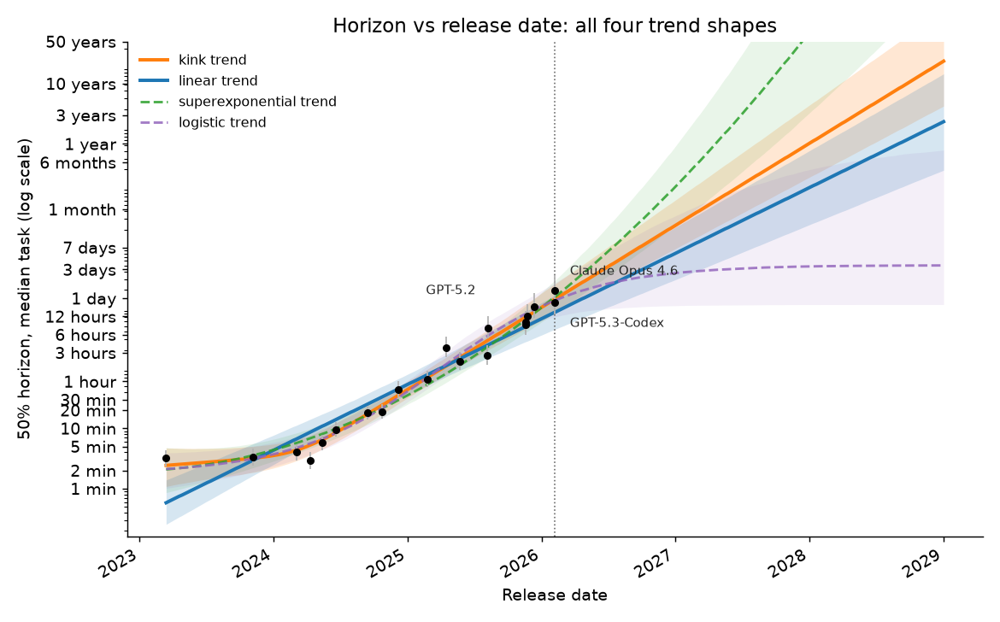
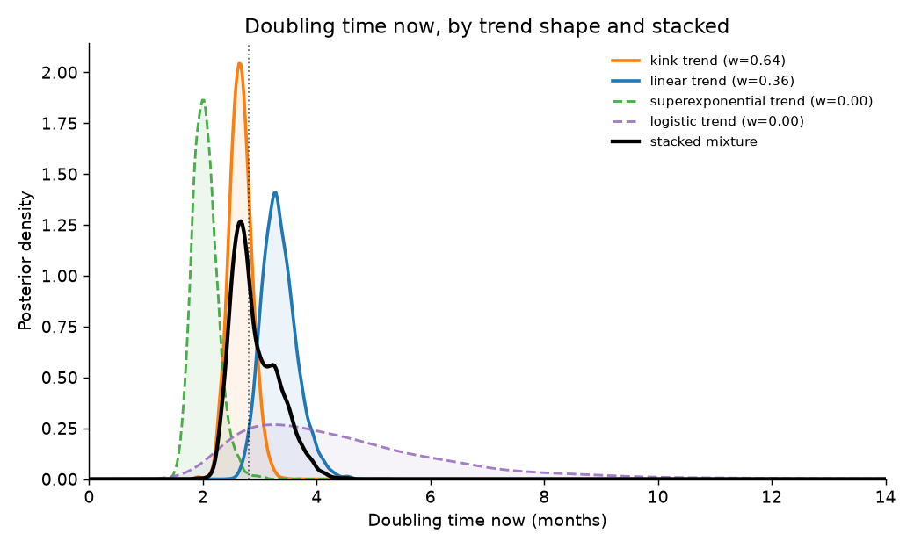
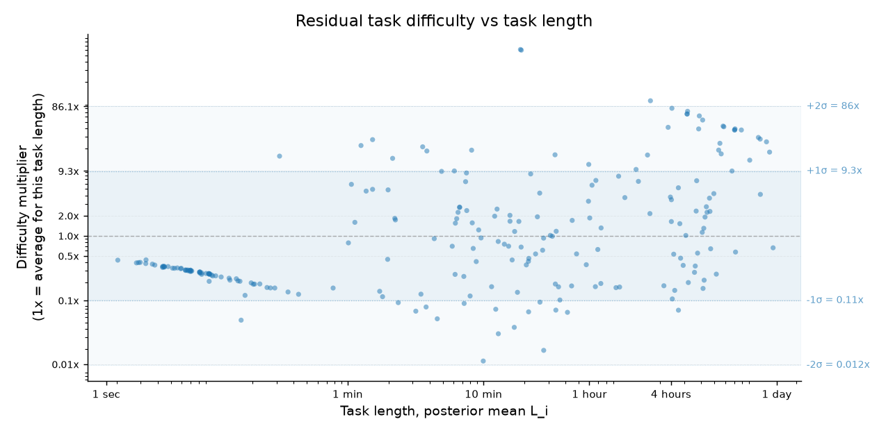
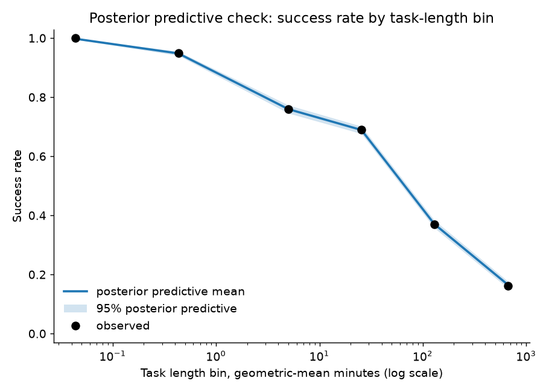
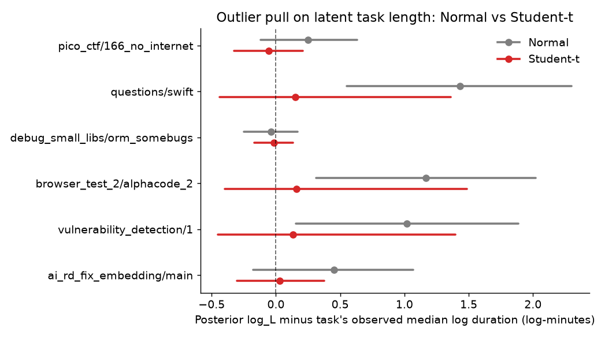
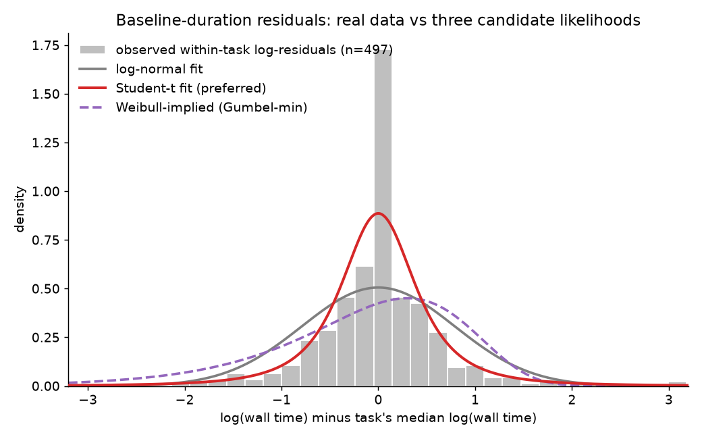

# Full results

Moved out of the README to keep that file focused on the codebase itself. This is every number and plot behind the headline claims, in the order they were produced.

The Student-t measurement layer is the preferred variant (see below for
why), stacked across the four trend shapes. This is what that combination
says, with plots generated by `scripts/make_figures.py` from the fitted
`.nc` files in `outputs/`. The figures below
deliberately follow the same axis, tick, and annotation conventions as
Moss's own plots, so the two sets can sit side by side without any
translation.

## Doubling time and the trend shape

Stacked across the four trend shapes, current doubling time comes out to
**2.8 months [2.3, 3.8]**, weighted mostly toward the kink shape (exact
weights in the table below). The two main shapes disagree a little on
their own: a linear fit alone gives 3.3 [2.8, 4.0] months, and letting the
slope bend around 2024 (the kink shape) pulls that down to 2.7 [2.3, 3.1].
But that disagreement is small next to the uncertainty in the underlying
elpd estimates, so this reads less like "kink wins" and more like "the
success/failure data alone can't strongly separate the shapes." The
stacked interval is bimodal-ish rather than clean. Extrapolations should
use the stacked mixture.

Here's what that buys you, stance by stance. If you trust the
stacking weights as they came out, 0.635 kink and 0.365 linear
(superexponential and logistic contribute nothing), you get the stacked
2.8 [2.3, 3.8] months above. If instead you think the kink is fitting a
bend in recent, noisier data and would rather stay with the plainer
one-slope model, you'd use the linear-only 3.3 [2.8, 4.0] months instead.
The two aren't far apart and their intervals overlap heavily, so neither
stance changes the headline by much. Which one you find more convincing
is a real judgment call, and the data here don't make it for you.

```
shape       elpd_loo        weight   doubling time now (months)
kink        -2695.6 +- 81.4  0.635    2.7 [2.3, 3.1]
linear      -2696.2 +- 81.2  0.365    3.3 [2.8, 4.0]
superexp    -2696.9 +- 81.3  0.000    2.0 [1.7, 2.5]
logistic    -2698.4 +- 81.7  0.000    4.1 [2.2, 9.9]
STACKED                               2.8 [2.3, 3.8]
```

(Caveat: ~2% of PSIS pareto-k values exceed 0.7, the usual high-leverage
model-task cells; with weights this insensitive to elpd noise the
conclusion is unlikely to move, but exact re-fit LOO on the flagged cells
would be the rigorous check.)

### Same models as METR: the SOTA-only refit

The obvious suspect for the gap against METR's 4.2 months was the model
set. METR's headline trendline doesn't use every model they evaluated; it
keeps only the ones that were SOTA at their release date, defined as a
running frontier (a model stays in if its 50% horizon matches or beats the
best of everything released up to then). My fit was using all 20 dated
models. So I refit on exactly the 14 agents METR's published headline
trend uses (`--sota-only`, which reproduces their running-max rule from
their own logistic fits and drops Claude 3 Opus, Claude 4 Opus, Claude 4.1
Opus, GPT-4 Turbo, GPT-5.1-Codex-Max, and GPT-5.3-Codex), at the same run
settings as everything above.

It isn't the model set. The stacked estimate under METR's own 14 models is
**2.8 [2.3, 4.2] months**, the same headline as before. Per shape: kink
2.7 [2.3, 3.2] (weight 0.66), linear 3.6 [3.0, 4.5] (weight 0.34). The
linear-only number does drift about a third of the way toward METR's 4.2,
but the stacked headline doesn't move, because the kink shape keeps most
of the weight and its post-2024 slope barely notices the six dropped
models.

What separates the numbers is the trend shape, or equivalently
the time window. METR's 4.2 is a single exponential fit through the whole
2023-2026 SOTA series, slower pre-2024 stretch included; the stacking here
mostly backs a bend at early 2024 with a faster slope after it. Line the
windows up and the disagreement disappears: METR's own post-2024 SOTA
trendline comes out at 3.0 months [2.4, 4.0], right on top of the kink
fit's 2.7. And the comparison with Moss's 4.3 was never about model
selection at all: he fits all the v1.1 models, same as my default, and
his headline is linear-only by construction, so the right pairing there is
my linear 3.3, with the remainder down to the added measurement-error
layer and the per-model random effects rather than to the data going in.



Per-model 50% horizons (points, from the kink fit) go from a few minutes
in 2023 to somewhere around 20 hours by early 2026, the same post-2024
acceleration METR reports from their own pipeline. All four fitted shapes
are on the plot at once, and the x-axis runs out to 2029 (about three
years past the last dated model, marked by the dotted line).
That forecast window is the whole point of overlaying them: over the span
the data cover, the shapes mostly agree with each other and with
the points, which is exactly why the stacking weights above don't land
decisively on one of them. Then they pull apart as soon as the data run
out. By 2029 the linear trend reaches a horizon of about three years,
the kink trend an order of magnitude past that, the superexponential has
left the chart entirely, and the logistic has flattened out near three
days. Full breakdown:

| shape | trend f(t_m) | weight | what it found |
|---|---|---|---|
| kink | `beta0 + beta1*t + delta*softplus((t-t_k)/w)*w` | 0.635 | breakpoint at early 2024 (t_k = -0.87 +- 0.15), slope jumps from 0.41 [-0.43, 1.21] to 3.14 [2.70, 3.59]; sigma_u falls 0.70 -> 0.38, a sign it's absorbing real structure rather than noise |
| linear | `beta0 + beta1*t` | 0.365 | one steady slope, no bend needed to fit the data about as well |
| superexponential | `beta0 + beta1*t + beta2*t^2` | 0.000 | same acceleration as the kink, told as curvature: positive beta2 in log-horizon over time |
| logistic | `beta0 + h*sigmoid((t-t0)/s)` | 0.000 | ceiling parameter pinned at its prior edge, inflection point pinned at the data edge, degenerates to "still rising," no saturation signal in this data |

The logistic row's wide, poorly-identified slope is also why its band on
the plot above is visibly the widest of the four.

The same "shape is underdetermined" point shows up again if you look
straight at the doubling time each shape implies right now, rather than
at the horizon curve it draws:



Kink and linear stack up into two narrow, mostly-overlapping peaks a
month or so apart; superexponential sits off to the left, faster; and
logistic is the flat, wide smear stretching out past a year, which is
just its poorly-identified slope again, now seen as a distribution
instead of a fan of lines. The black curve is the stacked mixture (the
same weights as the bar chart above), and it's visibly not a single
clean peak. It's dragged a little bimodal by kink and linear disagreeing
with each other more than either disagrees with itself.

## sigma_eps: the residual difficulty term

**sigma_eps = 2.07-2.28 log-minutes**, depending on shape and
robustness variant: residual task-difficulty spread of about 8x at fixed
task length. This is the empirical case for having the whole
measurement-error/heterogeneity layer at all, and it's also the thing any
horizon extrapolation ("when do we hit a 1-month horizon") is most
sensitive to.

Let me think through that number.
An 8x spread means a task that looks like ten minutes of human time can,
for the model, be as hard as something that would take a person an hour
and twenty minutes, or the reverse: a task that reads as an hour-long
slog can be about as easy for the model as a ten-minute one. Put that way
it doesn't strike me as an unreasonable number. Task length is only a
rough proxy for what makes a task hard for a model: how much it
has to hold in context, how many tool calls it needs to get right in a
row, whether it's the kind of reasoning these models are good at or not.
I'd expect that proxy to be noisy by more than a small factor, and if
anything I'd have guessed this range could come out wider still.

This is our version of the figure Jonas Moss uses to make the same point
in his post, plotted the same way he does it: each task's difficulty
multiplier (how many times longer or shorter its equivalent difficulty
time is than its actual human time, `exp(eps_i)`) against its posterior-
mean length `L_i`, with dotted +-1sigma / +-2sigma reference bands so the
scatter can be read directly against the fitted `sigma_eps` above.



The scatter isn't perfectly flat: the shortest tasks (well under a
minute, almost always solved regardless of the model) cluster low and
tight, and the longest ones drift upward, both plausibly real rather than
artifacts. Trivial tasks don't leave much room for difficulty variation
either way, and the very longest tasks may demand more sustained
precision than their length alone implies. But across the bulk of the
range, roughly six seconds to four and a half hours, there's no visible
trend, and the vertical spread stays enormous throughout, sitting mostly
inside the +-1sigma band (0.11x-9.3x) with a fair number out past
+-2sigma (0.012x-86x). Tasks that take people about the same time can
differ wildly in how hard they are for a model.

## Posterior predictive check

All 20 models' success rates land inside their 95% posterior predictive
interval, and every task-length bin is calibrated except the trivial
<0.1-minute bin (obs 1.000 vs pp [0.996, 1.000]).



## Student-t vs Normal measurement layer (`--robust`)

The wall-clock data has genuinely heavy tails. People take breaks
mid-task, so a few runs end up far longer than the rest of that same
task's attempts. The worst cases are 3-4 log units off the task median
(a 249-min run on a 4-min-median task, a 2185-min run on a 96-min-median
one). Under a Normal likelihood, single runs like these drag the task's
latent `log_L` around and inflate `sigma_base` for every task, not just
the ones with outliers. `--robust` swaps the baseline-run likelihood to a
Student-t with an estimated degrees-of-freedom parameter (prior mean 20,
near-Normal a priori) so the tails are learned from the data rather than
imposed.

The data decisively reject Normal tails: the fitted dof comes out to 2.4
[1.8, 3.2], about as heavy as a t-distribution gets. So the Normal fit
had been treating outlier noise as core noise, its `sigma_base` (0.79) is
almost double the Student-t's fitted scale (0.41) for what's supposed to
be the same everyday within-task variability. None of this moves the
headline, though: doubling time comes out at 3.4 [2.8, 4.2] months under
Normal vs 3.3 [2.8, 4.0] under Student-t, and sigma_eps 2.14 vs 2.22,
close enough that the outliers were never driving the trend. Now that's
demonstrated.



No data was deleted to get this; it's the same six tasks under both
likelihoods, and the Student-t fit's pull toward the task's observed
median duration shrinks in every case (e.g. `questions/swift`: +1.43 log
units under Normal down to +0.15 under Student-t).

## Weibull duration likelihood (`--duration-dist weibull`)

Moss suggested this in the post itself: "I would also try a Weibull
distribution instead of log-normal, since the log-normal is typically
heavier-tailed and the Weibull is easier to justify on theoretical
grounds." I tried it, median-matched so `log_L` keeps the same "log
median wall time" meaning under every variant.

It samples as cleanly as the others, but fits the duration data
worse than both existing variants. PSIS-LOO on the 525 baseline runs
(Jacobian-corrected onto a common duration scale):

```
likelihood   elpd_loo (duration scale)   vs Student-t
studentt     -1097.5 +- 85.6
lognormal    -1164.9 +- 85.8             -67.5 (dse 14.7)
weibull      -1219.3 +- 86.6             -121.8 (dse 25.0)
```

The Weibull comes in worst of the three, and by enough that this isn't
LOO noise. The reason is a shape mismatch, and it's visible directly in
the data rather than just in the LOO number: our within-task residuals
are right-skewed with heavy tails, while the log of a Weibull is a
Gumbel-minimum, which is fixed left-skewed no matter what its shape
parameter does. Below, the gray histogram is the pooled within-task
log-residuals (each baseline run's log duration minus its own task's
median, for tasks with two or more timed runs); the three curves are the
log-normal, Student-t, and Weibull-implied densities from the fitted
parameters of each variant.



The Student-t (red) hugs the sharp peak and the long right tail at once;
the log-normal (gray) is close but a bit too spread in the center; the
Weibull-implied curve (purple dashed) can't do either. It's forced into
roughly the same shape on both sides, so it undershoots the peak and
mismatches the skew. That's the skew +1.09, excess kurtosis 8.2 finding
made visible: structurally the wrong shape for this data. The headline
is unchanged either way (doubling time 3.3 [2.8, 4.1] months,
sigma_eps 2.21 vs 2.22 either way), so this is a clean negative
result. Moss's suggestion was reasonable for task-completion
times in the abstract, but our wall-clock times (breaks, multi-hour
interruptions included) are heavy- and right-tailed in a way a Weibull
can't be.

## sigma_est recalibrated to Barry's 60%-within-3x finding

Alexander Barry, in the comments on Moss's post, reports that only ~60% of
estimate-only human time annotations land within a factor of 3 of the
actual baseline time when both exist. Our data can't check this directly
(none of the 228 tasks carry both annotation types), so his finding
enters as an external prior instead: matching his 60% figure implies a
prior median of 1.25 log-minutes for `sigma_est`,[^2] well above the 0.8
we'd been using. Refitting with the wider prior moves the posterior for
`sigma_est` up substantially (0.65 [0.27, 1.28] -> 0.85 [0.38, 1.52]), but
that's basically the only thing that moves: doubling time and sigma_base
land within a couple hundredths of where they started, and sigma_eps
shifts a bit more (2.22 -> 2.17). The
headline is robust to a big shift in this prior; only the 67
estimate-only tasks' latent lengths get honestly less certain.

## Estimate-only feedback: Barry's circularity warning, checked

Barry also raised a sharper methodological point about this class of
model: once you jointly model uncertainty over the discrimination `a_i`
and the task length `log_L_i`, success/failure outcomes can move the
inferred lengths, and a Bayesian model built this way can end up more
misleading than the frequentist original it replaces. The exposed surface
here is the 67 estimate-only tasks, whose only timing datum is one
annotation: the IRT layer has room to re-date such a task to explain its
outcomes, pulling a task models keep solving shorter and a task they keep
failing longer, so the trend is then partly fit to lengths the outcomes
themselves chose.

`scripts/estimate_feedback_diagnostic.py` measures how much of this is
happening in a saved fit: for each estimate-only task, the shift between
the posterior mean of `log_L_i` and the raw annotation, and the
correlation of those shifts with the task's pooled success rate. On
`outputs/fit_kink_robust.nc`: mean shift +0.03 log-minutes (no aggregate
bias), sd 0.26, corr(shift, success rate) = -0.53. So the mechanism is
real and operating in the fitted posterior, in the predicted direction,
with per-task pulls that stay well inside the posterior `sigma_est` scale
(~0.72), a fraction of the annotation noise the model already assumes.

Whether it moves the headline is answered by a cut-model refit
(`--cut-estimate-feedback` in `scripts/fit_model.py`): for the 67
estimate-only tasks, the IRT layer sees the raw annotation as a fixed
constant in place of the latent `log_L_i`, so the loop is broken. With a
single annotation and no timed runs, the measurement-only posterior mean
of `log_L_i` essentially is the annotation, so this clamps those tasks at
their measurement-only estimate; the 161 baseline-informed tasks are
untouched, and `eps_i` stays free. Refit at the same settings as the
robust fits (2000 tune / 2000 draws / 4 chains, nutpie, target_accept
0.95, Student-t; 0 divergences, max R-hat 1.04):

```
shape    joint (feedback on)   cut (feedback off)
kink     2.7 [2.3, 3.1]        2.6 [2.3, 3.0]
linear   3.3 [2.8, 4.0]        3.3 [2.8, 4.0]
```

The kink medians are 2.65 vs 2.62 months before rounding, a delta of
about a day; the linear numbers agree to the same precision. Stacking the
two cut shapes gives 2.6 [2.3, 3.0] with all weight on kink (elpd gap 3.6
+- 2.1; superexponential and logistic already took weight 0.000 in the
four-shape joint stack, whose headline is the 2.8 [2.3, 3.8] above). So
allowing the feedback versus cutting it changes the doubling time by a
few hundredths of a month per shape: the circularity is present and
detectable, and its effect on the headline is second-order, now
demonstrated by refit.

One caveat survives the check: for estimate-only tasks, `eps_i` and
`log_L_i` are only weakly separately identified (the IRT layer informs
their sum), so the posterior `log_L` for those tasks should not be read
as a purified human-time estimate.

## Simulation-based calibration

Reduced-scale SBC (Talts et al. 2018), 50 tasks x 8 models x 50
replications, mimicking the real data's sparsity (1-3 timed runs per
task, 20% estimate-only, 8 IRT attempts per model-task cell). Each rep
refits at 800 tune / 500 draws / 2 chains. Result: **pass, 50/50 reps
fit**.

```
param        mean rank    KS p  cov50  cov90
mu_L             0.432   0.190   0.38   0.92
sigma_L          0.570   0.256   0.48   0.92
sigma_base       0.457   0.544   0.48   0.94
sigma_est        0.442   0.190   0.58   0.92
sigma_a          0.545   0.434   0.50   0.86
sigma_eps        0.479   0.256   0.60   0.94
beta0            0.505   0.881   0.46   0.86
beta1            0.466   0.190   0.50   0.88
sigma_u          0.525   0.662   0.46   0.84
```

Mean normalized ranks all in 0.43-0.57 (target 0.5), KS-vs-uniform p >=
0.19 on every parameter, central-interval coverage within Monte Carlo
error of nominal everywhere. No sign of the classic pathologies (rank
pile-up at 0/1 = overconfidence, hump at 0.5 = underconfidence, mean
shift = bias). This run is for the Normal-layer linear model at reduced
scale, under the original sigma_est prior (median 0.8); SBC at the robust
variant and full scale is listed under Open work in the README.

I generated the rank histograms too (`outputs/figures/sbc_ranks.png`) but
I'm not embedding them here: at only 50 reps per parameter they're too
noisy-looking to add anything past the table above (a truly uniform
histogram at n=50 can look almost as lumpy as these do by chance), and the
KS test is the right tool for a claim this size. Same reasoning for `outputs/figures/stacking_weights.png`:
it's the four numbers already in the stacking table above, and a bar
chart of them doesn't teach anything the table doesn't.

[^2]: Barry's finding is `P(|N(0, sigma)| < ln 3) = 0.6`, which inverts to
    `sigma = ln(3) / Phi^-1(0.8) ~= 1.305` log-minutes of total
    estimate noise. Net of the baseline geometric mean's own ~0.3 noise
    contribution, that's the ~1.25 prior median used for
    `sigma_est`.
