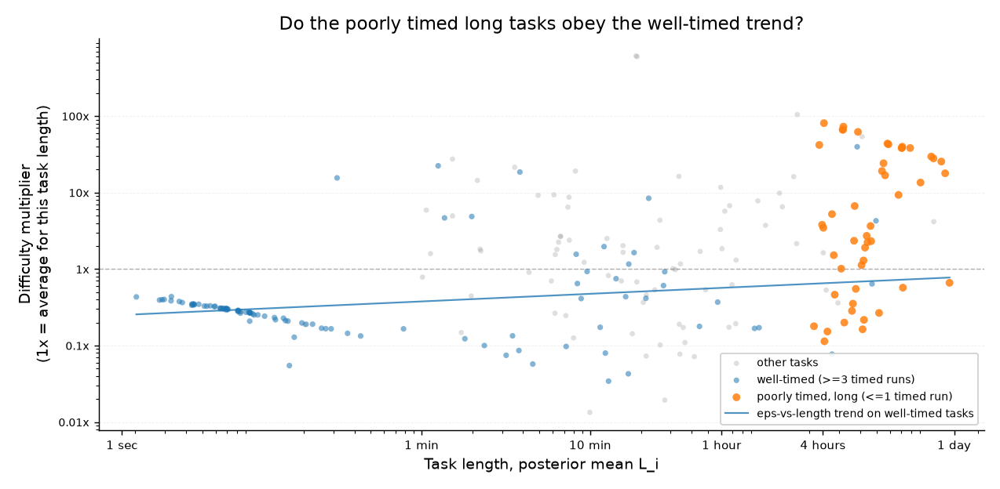

# A measurement-error model for METR's time horizon

Based on:
- Alexander Barry's [note on modeling assumptions](https://metr.org/notes/2026-03-20-impact-of-modelling-assumptions-on-time-horizon-results/)
- Jonas Moss's [IRT reanalysis](https://www.lesswrong.com/posts/sBEzomgnYJmYHki9T).

Results:

- Doubling time: ~3.3 months on the plain linear trend, dropping to
  2.4 months (95% credible interval: 2.1–2.7) with all the refinements
  included.
- Tasks of the same human length differ ~8x in how hard they are for
  models. Roughly two thirds of that (as variance, in log space) is
  predictable task-family structure,
  leaving a within-family spread near 5x, which agrees with Moss's ~4.7x.
- Barry found that removing the timing noise cuts the frontier model's 50%
  horizon by 25–40%. My model shows only ~10% (more on that in section 2).

## 1. The model

The timing layer is Barry's noise model with the true length hidden: each
task has an unknown true length where timed runs scatter around it and
estimate annotations scatter *more*. How much more comes from Barry's
measurement: 80% of expert estimates fall within ~4x of the true length,
which I use as the prior on the estimate noise. A free fit recovers a
timing noise of 0.79 (log scale), close to the 0.78 Barry estimated by
hand, this is a number the fit never sees. A Student-t version splits that into a tighter core
(0.41) plus heavy tails, a better description of wall-clock times that
include breaks and interruptions.

The success layer is Moss's IRT setup: how often each AI model succeeds at
each task pins down ability and difficulty, with difficulty = the task's
latent length + a per-task residual `ε` (Moss's unexplained difficulty).
There is a big change here: the success data only see the gap between ability
and difficulty, so a constant could shift freely between `ε` and every
ability score. Moss pins two abilities to stop this. Doing that here would
break the interpretation of ability as a log time horizon, so I force `ε` to sum to
zero across tasks instead.

The trend layer is Moss's ability-over-release-date curve, plus a
per-model offset so the doubling-time interval reflects real
model-to-model scatter. Four curve shapes, averaged by Bayesian stacking.

Below is the plate graph for the model. (Circles are unknowns, shaded circles are
data, and the plates show what repeats per task and per model.) The three
plates at the bottom are the three data sources: success/attempt counts, estimate annotations, and timed runs.


## 2. The SIMEX comparison

I spent some time on Barry's SIMEX analysis, because at first glance
my model kind of contradicts it. If I removed the timing noise his frontier
50% horizon falls 25–40% and mine fell ~10%. To make sure this gap wasn't the two of us measuring different things, I ran his exact method on my model (in `scripts/simex.py` I add extra noise to the timing, refit, extrapolate back to zero noise) and got an essentially flat line, so the ~10% holds under his own procedure.

So **the gap is `ε`.** The horizon depends on difficulty, and what the success
data constrain is length + `ε` together. METR's model has no `ε`, so in that model difficulty just is length: shrink a noisy over-long task and the horizon comes down with it. Barry's 25–40% is exactly right for that model. Give each task its difficulty residual (fitted σ ≈ 2.2 in log units) and timing noise mostly moves the split between length and `ε`; their sum, and with it the horizon, stays almost unchanged.

This is what that residual looks like in the data, each point is a task, plotted by its length and by how many times harder or easier it is than that length suggests. The vertical spread is the ~8x:


**An attempt to falsify it.** The obvious worry is that `ε` absorbs
length bias it should not. If a long-human,
model-easy task is really a mis-timed short task, `ε` should be
systematically negative on the long, poorly timed tasks. The data show
the opposite (`scripts/fork_discriminator.py`): on well-timed tasks, longer
tasks are mildly harder than their length predicts, and the poorly timed long
tasks sit clearly above even that trend. They are the 8-hour
RE-Bench-style tasks, which are genuinely hard, and the model agrees.



**Why 10%.** The absorption is not perfect, for two
reasons. First, length and `ε` trade off strongly in the fit but not completely. Second, success data can only resolve a
task's difficulty to within ~2.3x, even for the long tasks that every
model attempted ~90 times. Those two gaps let some of the
timing noise through: Barry's 25–40% becomes ~10%.

## 3. The additions

**Marginal and conditional horizons.** Barry's note has the 50% horizon
dropping under noise correction while the 80% horizon rises. The same
split appears in my model from the difficulty side: the residual is
symmetric around zero so it cancels at the 50% point.
But, the success curve for the whole task population is ~1.9x flatter than
for a single typical task, so the 80% horizon rises.

**Length-dependent noise.** The spread between attempts grows with task
length (more can go wrong in a six-hour attempt than in a six-minute one).
Letting the noise scale with length clearly improves the timing fit. It
doesn't change the doubling time.

**Survivorship.** Only successful human runs anchor task length, but 129
failed timed runs sit on the hard tasks, with median times in the hours.
Adding them as "took at least this long" observations lifts those tasks'
lengths, the opposite of Barry's long-task shrinkage; probably both effects are real, on different tasks. I keep it as METR defines the human baseline only with successful completions.

**Structure in the difficulty.** Splitting `ε` into a task-family effect plus a within-family residual shows ~two thirds of the difficulty spread is between families. Pattern-continuation and cryptanalysis run ~100x harder than their length suggests, arithmetic and file-selection ~100x easier. The within-family spread is ~5x, matching Moss's ~4.7x. And because the trend is fit on difficulty, and `ε` is the biggest part of difficulty, this is the one refinement that moves the doubling time: 2.4 months (2.1–2.7).


## 4. Conclusion


The doubling time stays between 2.4 and 3.3 months in every version of
the model, so the trend does not depend on how the timing is handled.
Removing the timing noise shifts the horizon by only 9–11%, roughly a
third of Barry's 25–40%. That ~10% remains because success data can only
measure a task's difficulty to within ~2.3x, even on tasks every model
attempted ~90 times, and that uncertainty lets a small part of the
timing noise reach the horizon.

## Appendix: full model specification

Task $i$, AI model $m$, timed run $j$. Data: timed human runs
$\log d_{ij}$, estimate-only annotations $\log r_i$, success counts
$(s_{im}, n_{im})$, release dates $t_m$ (years, centered on the dated
models' mean). Lengths, difficulties, and abilities all live on the
log-minutes scale. The blocks below give the headline configuration
(kink trend, Student-t timing, length-dependent noise,
family-structured $\varepsilon$); variants at the end. Implementation:
`build_model` in `models/time_horizon_model.py`, one likelihood per
observation group.

### Measurement layer

Each task's true log length $\log L_i$ is latent. Timed runs scatter
around it with heavy tails; annotations scatter more, with the noise
scale growing in task length:

```math
\begin{aligned}
\mu_L &\sim \mathrm{Normal}(3,\ 2) \\
\sigma_L &\sim \mathrm{HalfNormal}(1.5) \\
\log L_i &\sim \mathrm{Normal}(\mu_L,\ \sigma_L) \\
\sigma_{\mathrm{base}} &\sim \mathrm{HalfNormal}(1) \\
\gamma_\sigma &\sim \mathrm{Normal}(0,\ 0.5) \\
\sigma_{\mathrm{base},i} &= \sigma_{\mathrm{base}}\, e^{\gamma_\sigma (\log L_i - \mu_L)} \\
\nu &\sim \mathrm{Gamma}(2,\ 0.1) \\
\log d_{ij} &\sim \mathrm{StudentT}(\nu,\ \log L_i,\ \sigma_{\mathrm{base},i}) \\
\sigma_{\mathrm{est}} &\sim \mathrm{LogNormal}(\log 1.25,\ 0.5) \\
\log r_i &\sim \mathrm{Normal}(\log L_i,\ \sigma_{\mathrm{est}})
\end{aligned}
```

The $\sigma_{\mathrm{est}}$ prior median comes from Barry's finding (LW
comments on Moss's post) that ~60% of annotations fall within 3x of
the baseline time: $\ln 3 / \Phi^{-1}(0.8) = 1.305$ total log-sd,
minus the baseline geomean's own ~0.3 contribution $\to$ ~1.27. No
task has both annotation types, so the data cannot check this; it
enters as prior evidence only. $\gamma_\sigma = 0$ recovers the
homoscedastic model.

Code: `mu_L`, `sigma_L`, `log_L`, `sigma_base`, `gamma_sig`, `nu`,
`sigma_est`; likelihoods `dur_base_obs`, `dur_estimate`.

### Success layer (2PL IRT)

Difficulty is the latent log length plus a residual $\varepsilon_i$,
decomposed into a task-family effect $\eta_{f(i)}$ (family index $g$,
$f(i)$ the task's family) and a within-family residual $\zeta_i$:

```math
\begin{aligned}
\sigma_a &\sim \mathrm{HalfNormal}(0.5) \\
\log a_i &\sim \mathrm{Normal}(0,\ \sigma_a) \\
\sigma_{\mathrm{fam}} &\sim \mathrm{HalfNormal}(0.5) \\
\sigma_{\mathrm{within}} &\sim \mathrm{HalfNormal}(0.5) \\
\eta_g &\sim \mathrm{Normal}(0,\ \sigma_{\mathrm{fam}}) \\
\zeta_i &\sim \mathrm{Normal}(0,\ \sigma_{\mathrm{within}}) \\
\varepsilon_i &= \eta_{f(i)} + \zeta_i - \overline{(\eta + \zeta)} \\
\operatorname{logit} p_{im} &= a_i \left(\theta_m - (\log L_i + \varepsilon_i)\right) \\
s_{im} &\sim \mathrm{Binomial}(n_{im},\ p_{im})
\end{aligned}
```

Subtracting the realized mean pins $\sum_i \varepsilon_i = 0$ exactly.
Identification: the likelihood sees only
$\theta_m - (\log L_i + \varepsilon_i)$, so a constant shifts freely
between $\varepsilon$ and all $\theta_m$; Moss anchors two abilities
instead, which here would break $\theta$'s log-minutes interpretation.

Code: `sigma_a`, `a`, `sigma_eps_fam`, `sigma_eps_within`, `eps`;
likelihood `successes`.

### Ability trend

Ability is a shape function of release date plus a per-model offset;
undated models get only the intercept and offset. The headline kink
shape:

```math
\begin{aligned}
\beta_0 &\sim \mathrm{Normal}(0,\ 1.5) \\
\beta_1 &\sim \mathrm{Normal}(0,\ 1) \\
\delta &\sim \mathrm{Normal}(0,\ 1) \\
t_k &\sim \mathrm{Normal}(0,\ 0.75) \\
f(t) &= \beta_0 + \beta_1 t + \delta\, w\, \mathrm{softplus}\!\left(\tfrac{t - t_k}{w}\right), \quad w = 0.1\ \text{yr} \\
\sigma_u &\sim \mathrm{HalfNormal}(1) \\
u_m &\sim \mathrm{Normal}(0,\ \sigma_u) \\
\theta_m &= \beta_0 + \left(f(t_m) - \beta_0\right)\mathbb{1}[\text{dated}_m] + u_m
\end{aligned}
```

The other three shapes, combined with the kink by Bayesian stacking
(PSIS-LOO on the success likelihood, the only term the shapes differ
on):

```math
\begin{aligned}
\text{linear:}\quad & f(t) = \beta_0 + \beta_1 t \\
\text{super-exponential:}\quad & f(t) = \beta_0 + \beta_1 t + \beta_2 t^2, \quad \beta_2 \sim \mathrm{Normal}(0,\ 0.5) \\
\text{logistic:}\quad & f(t) = \beta_0 + h\, \mathrm{sigmoid}\!\left(\tfrac{t - t_0}{s}\right), \\
& \beta_0 \sim \mathrm{Normal}(0,\ 2),\ h \sim \mathrm{HalfNormal}(8),\ t_0 \sim \mathrm{Normal}(0,\ 1),\ s \sim \mathrm{LogNormal}(\log 0.5,\ 0.5)
\end{aligned}
```

Conditional ($\varepsilon = 0$) 50% horizon at time $t$: $e^{f(t)}$
minutes. Current doubling time:
$\mathrm{DT} = 12 \ln 2 \,/\, f'(t_{\mathrm{now}})$ months, with
$t_{\mathrm{now}}$ the latest dated model's release date.

Code: `beta0`, `beta1`, `delta`, `t_k`, `sigma_u`, `u`, `theta`,
`slope_now`.

### Sampling

$\log L_i$, $\log a_i$, $\eta$, $\zeta$, and $u_m$ are sampled in
non-centered form, e.g.

```math
\log L_i = \mu_L + \sigma_L z_i, \qquad z_i \sim \mathrm{Normal}(0,\ 1)
```

with only 1–2 timing observations per task, the centered form is a
funnel (divergences, $\hat{R} > 2$); non-centering fixes the geometry.
NUTS via `pm.sample`; simulation-based calibration in `scripts/sbc.py`.

### Variants

Each changes one piece of the headline model:

| Variant | Change |
| --- | --- |
| Normal timing | $\mathrm{StudentT} \to \mathrm{Normal}$ for timed runs |
| Weibull timing | $d_{ij} \sim \mathrm{Weibull}(\alpha_w,\ \beta_i)$, raw scale, median-matched $\beta_i = L_i / (\ln 2)^{1/\alpha_w}$ so $\log L_i$ stays the log median wall time |
| Flat $\varepsilon$ | $\varepsilon_i \sim \mathrm{ZeroSumNormal}(\sigma_\varepsilon)$, $\sigma_\varepsilon \sim \mathrm{HalfNormal}(0.5)$ |
| Survivorship | failed human runs right-censored at wall time $c_{ij}$: term $P(\log d_{ij} > \log c_{ij})$; same path handles time-limit censoring (none in current data) |
| Cut | estimate-only tasks: IRT layer uses $\log r_i$ as a fixed constant, not the latent $\log L_i$ |
