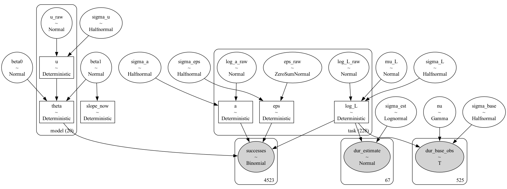
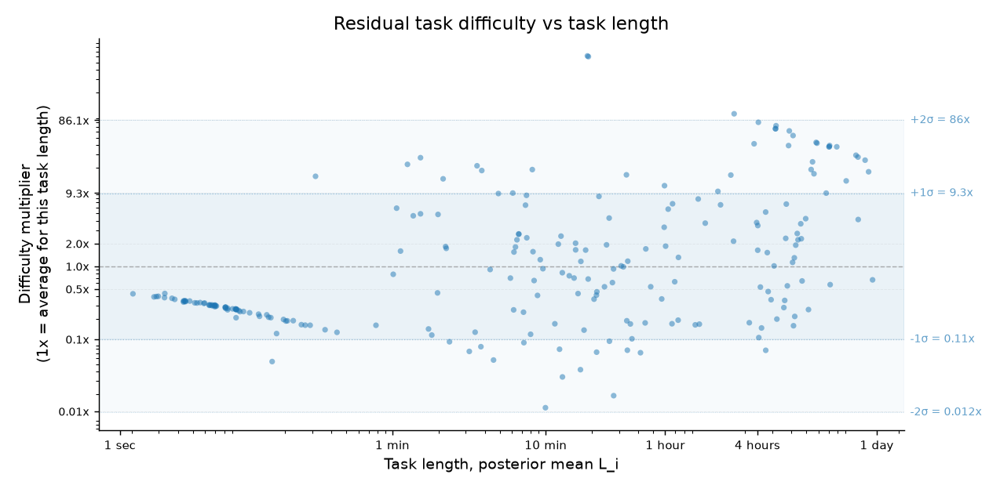
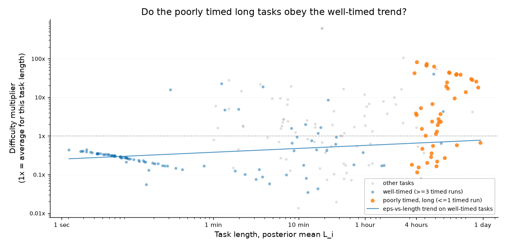
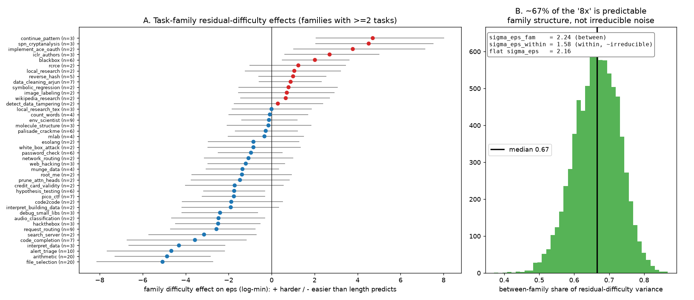
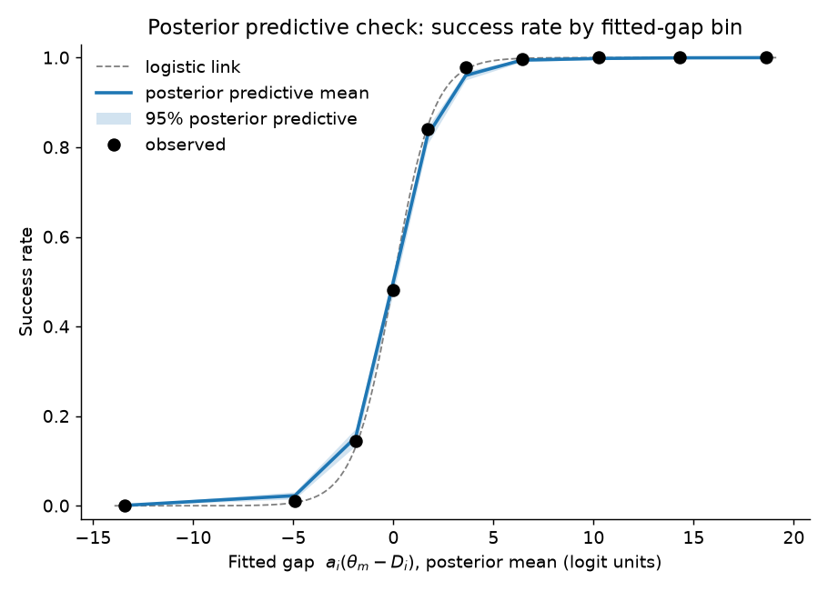
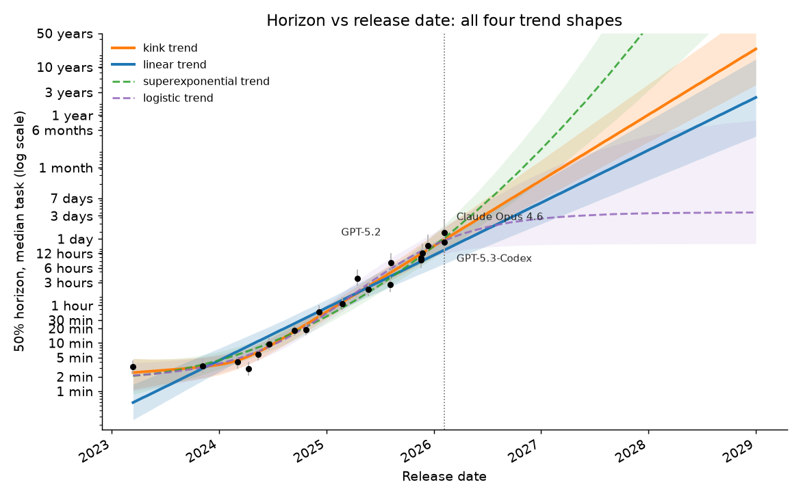

# A measurement-error model for METR's time horizon

Based on:
- Alexander Barry's [note on modeling assumptions](https://metr.org/notes/2026-03-20-impact-of-modelling-assumptions-on-time-horizon-results/)
- Jonas Moss's [IRT reanalysis](https://www.lesswrong.com/posts/sBEzomgnYJmYHki9T).

In his writeup, Alexander Barry lists the noise in the task length estimates as the assumption he trusts least. This proposed model treats noise together with the success data rather than as a correction afterwards. Our two analyses disagree, and I want to talk more to him about it.

On the scope of this model: This only tackles the measurement question. Barry thinks the biggest source of uncertainty in the horizon results is the task distribution rather than the analysis choices, and I don't touch that here, nor the question of what the time horizon metric itself means.

Results:

- The doubling time is about 3.3 months under a plain linear trend and 2.4 months (95% credible interval 2.1–2.7) with all the refinements included. This number is based on the kink trend but the data itself doesn't favor any of the shapes over another.
- Tasks of the same human length differ widely in how hard they are for models. About two thirds of that variance follows the task-family structure, and the spread within a family is a factor of about 5, close to Moss's 4.7.
- Removing the timing noise moves the 50% horizon by about 10% against Barry's 25–40%. Section 2 explains why.
- The 50% horizon for a typical task is around 66 hours (37 to 124) for the latest model in the data, and the median trend reaches one FTE-month of human time about 3 months after that model's release.

## 1. The model

The model has three 'layers' one per data source, I will explain them in order.

The first, the timing layer, is Barry's noise model, with the true length treated as unknown. Each task has a latent true length, the timed runs scatter around it, and the estimate annotations scatter more. How much more is fixed by a prior taken from Barry's calibration, that about 60% of expert estimates fall within 3x of the baseline time. When I instead let the timing noise be a free parameter, the fit recovers 0.79 on the log scale, close to the 0.78 that Barry estimated by hand. The fit never sees his number, so this is a genuine check, if a weak one. A Student-t version has scale 0.48 and heavy tails (ν = 2.8, interval 2.0 to 4.1, nowhere near Normal), which looks like the right description for wall-clock times that include breaks and interruptions.

Second, the success layer, is Moss's IRT setup. How often each AI model succeeds at each task pins down the abilities and the difficulties, and difficulty is the task's latent length plus a per-task residual `ε`, which is Moss's unexplained difficulty. The success data only see the gap between ability and difficulty, so a constant can move freely between `ε` and every ability. Moss stops this by anchoring two abilities, which here would break the reading of ability as a log time horizon, so I make `ε` sum to zero across tasks instead.

The trend layer is Moss's ability-over-release-date curve, with a per-model offset added so that the doubling-time interval reflects real model-to-model scatter rather than binomial noise alone. I fit four curve shapes and average them by Bayesian stacking.

Below is the plate graph. Circles are unknowns, shaded circles are data, and the three bottom plates are the three data sources: success counts, estimate annotations, and timed runs. [More on this](https://en.wikipedia.org/wiki/Plate_notation)



## 2. The SIMEX comparison

This model looks at first like it contradicts Barry's SIMEX analysis. Removing the timing noise drops his frontier 50% horizon by 25–40% and mine by about 10%. To rule out that we were measuring different things, I ran his method on my model, where `scripts/simex.py` adds extra noise to the timings, refits, and extrapolates back to zero noise, and I got a nearly flat line. So this 10% holds under his own procedure.

The difference comes from `ε`, and the posterior shows how (`scripts/tradeoff_stats.py`). On the poorly timed tasks, the ones with at most two timed runs or only an estimate, the posterior correlation between a task's length and its `ε` is about −0.8. The success data pin the sum `log L + ε` (posterior sd 0.5 to 0.8) better than they pin either part, so the timing noise moves the split between length and `ε` while the sum, which is what the horizon depends on, stays where it was. On the well-timed tasks the correlation is near zero, because three or more timed runs pin the length (posterior sd 0.29) and `ε` then carries the rest on its own. METR's model has no `ε`, so difficulty there is length, and shrinking a noisy over-long task lowers the horizon directly. Barry's 25–40% is the right answer for that model.

The figure below shows the residual from the flat-`ε` fit (σ ≈ 2.2 in log units, a factor of about 9). Each point is a task, placed by its length and by how many times harder or easier it is than its length predicts.



I tried to falsify this. The worry is that `ε` absorbs length bias that it should not. If a task that is long for humans but easy for models is really a mis-timed short task, then `ε` should come out systematically negative on the long, poorly timed tasks but it does not (`scripts/fork_discriminator.py`). On the well-timed tasks, longer tasks are mildly harder than their length predicts, and the poorly timed long tasks sit above even that trend. These are the 8-hour RE-Bench-style tasks, which are hard for models, and the fit assigns them positive `ε` accordingly.



I think the 10% can't be 0 because the absorption has limits. There is a strong trade-off, and the success data measure difficulty well only near the frontier. For the 126 tasks that the models sometimes solve and sometimes fail, the posterior pins difficulty to a factor of about 1.5. For the 17 tasks every model fails and the 76 that nearly every model solves, the data bound difficulty from one side only and the factor grows to 5 or more. Off the frontier the timing still carries information about difficulty, and part of the timing noise gets through to the horizon along with it.

## 3. Additions

### Marginal and conditional horizons

Barry's note has the 50% horizon dropping under noise correction while the 80% horizon rises. The same split appears here from the difficulty side. The residual is symmetric around zero, so it cancels at the 50% point, but it makes the success curve for the whole task population about 1.9x flatter than the curve for a single typical task, and the 80% horizon rises.

### Length-dependent noise

The spread between timed attempts grows with task length, as you would expect. Letting the noise scale with length improves the timing fit (γ_σ = 0.10, interval 0.07 to 0.14) and doesn't change doubling time.

### Survivorship

Only successful human runs anchor task length, but 129 failed timed runs sit on the hard tasks, with median times in the hours. Adding them as "took at least this long" observations lifts those tasks' lengths, which is the opposite direction from Barry's long-task shrinkage. I would guess both effects are real on different tasks. I left this out of the headline model because METR defines the human baseline from successful completions only.

### Structure in the difficulty

Splitting `ε` into a task-family effect plus a within-family residual puts about two thirds of the difficulty variance between families (share 0.67, interval 0.53 to 0.78). Pattern-continuation and cryptanalysis tasks run about 100x harder than their length suggests, and arithmetic and file-selection tasks about 100x easier. The spread within a family is a factor of 5.0 (sd 1.61, interval 1.27 to 1.96), close to Moss's 4.7, and the realized total spread is a factor of about 30 (sd 3.41), because the extreme families stretch the tails.

This is a refinement that moves the doubling time. It is not the task mix, since the attempt-weighted mean task length only moves from about 4 to 8 minutes across the model generations. What changes is the difficulty scale itself. With family structure, difficulty stretches along task length, with correlation +0.89 between a task's length and how much its difficulty moved relative to the flat model. The long-task families stop being shrunk toward zero and get harder, while the short ones get slightly easier. Each model's ability is read off where its 50% success crossing sits, and recent models cross on long tasks, so their abilities rise by 1.0 to 1.2 log units while early models rise by only 0.3. That rotation steepens the trend (slope 3.13 to 3.54 log units per year), taking the doubling time from 2.65 to 2.35 months within the kink shape.



### Does the success model fit?

Binning the task-by-model cells by task length wouldn't test much, because the free per-task `ε` can center each task wherever the data want. So I bin by the fitted gap `a_i(θ_m − D_i)` instead, which `ε` cannot absorb. `ε` moves a task equally for all models, the per-model offset moves a model equally for all tasks, and the gap axis cuts across both. The observed success rates track the logistic link in all ten bins, including the extremes. The one deviation is on the cells the model is confident about, meaning posterior mean success probability above 0.95, where there are 12033 attempts and 33 observed failures against 64 predicted (interval 45 to 85), with the failures spread over 30 cells rather than concentrated in one bad task. Barry's concern was the opposite, easy-task failures that an overconfident link would distort the fit to accommodate. I think this link is, if anything, too pessimistic in that tail.



## 4. Conclusion



However the timing is handled, the doubling time stays between 2.4 and 3.3 months, so the trend itself does not depend on the measurement model. Removing the timing noise entirely moves the horizon by 9 to 11%, about a third of Barry's 25–40%. The rest is absorbed by the difficulty residual, and the part that does get through comes from the tasks off the frontier, where the success data bound difficulty from one side only and the timing still matters.

The trend shape matters more than the measurement model does. The 2.4 (2.1–2.7) figure is conditional on the kink shape. The four shapes give 3.0 (2.5–3.6) for the linear trend, 2.4 (2.1–2.7) for the kink, 1.8 (1.5–2.4) for the super-exponential, and 3.6 (2.0–9.0) for the logistic, whose wide upper tail says that saturation cannot be ruled out. PSIS-LOO mildly prefers the logistic (elpd difference 2.4 with standard error 1.8, so not decisive), and stacking then gives it all the weight, which is a known artifact when the differences are within noise. LOO is itself only roughly trustworthy here, with 74 to 100 of the 4523 points above Pareto k = 0.7 in every fit. The data does not clearly pick a shape, and across shapes the current doubling time ranges from about 1.8 to 3.6 months, with intervals spanning 1.5 to 9.

Two smaller notes: The current 50% horizon for a typical task (`ε` = 0) is about 66 hours (37 to 124) for the latest model, and the marginal, whole-population horizon differs from this, as in section 3. The sum-to-zero convention for `ε` cannot affect the doubling time, because the doubling time is a slope and a constant shift in all abilities leaves slopes unchanged. Only the horizon level depends on that choice.

There are other parts of the horizon methodology I don't cover here, the task distribution above all.

## Appendix: full model specification

Task $i$, AI model $m$, timed run $j$. Data: timed human runs $\log d_{ij}$, estimate-only annotations $\log r_i$, success counts $(s_{im}, n_{im})$, release dates $t_m$ (years, centered on the dated models' mean). Lengths, difficulties, and abilities all live on the log-minutes scale. The blocks below give the headline configuration (kink trend, Student-t timing, length-dependent noise, family-structured $\varepsilon$); variants at the end. Implementation: `build_model` in `models/time_horizon_model.py`, one likelihood per observation group.

### Measurement layer

Each task's true log length $\log L_i$ is latent. Timed runs scatter around it with heavy tails; annotations scatter more, with the noise scale growing in task length:

```math
\begin{aligned}
\mu_L &\sim \mathrm{Normal}(3,\ 2) \\
\sigma_L &\sim \mathrm{HalfNormal}(1.5) \\
\log L_i &\sim \mathrm{Normal}(\mu_L,\ \sigma_L) \\
\sigma_{\mathrm{base}} &\sim \mathrm{HalfNormal}(1) \\
\gamma_\sigma &\sim \mathrm{Normal}(0,\ 0.5) \\
\sigma_{\mathrm{base},i} &= \sigma_{\mathrm{base}}\, e^{\gamma_\sigma (\log L_i - \mu_L)} \\
\nu &\sim \mathrm{Gamma}(2,\ 0.1) \\
\log d_{ij} &\sim \mathrm{StudentT}(\nu,\ \log L_i,\ \sigma_{\mathrm{base},i}) \\
\sigma_{\mathrm{est}} &\sim \mathrm{LogNormal}(\log 1.25,\ 0.5) \\
\log r_i &\sim \mathrm{Normal}(\log L_i,\ \sigma_{\mathrm{est}})
\end{aligned}
```

The $\sigma_{\mathrm{est}}$ prior median comes from Barry's finding (LW comments on Moss's post) that ~60% of annotations fall within 3x of the baseline time: $\ln 3 / \Phi^{-1}(0.8) = 1.305$ total log-sd, minus the baseline geomean's own ~0.3 contribution $\to$ ~1.27. No task has both annotation types, so the data cannot check this; it enters as prior evidence only. $\gamma_\sigma = 0$ recovers the homoscedastic model.

Code: `mu_L`, `sigma_L`, `log_L`, `sigma_base`, `gamma_sig`, `nu`, `sigma_est`; likelihoods `dur_base_obs`, `dur_estimate`.

### Success layer (2PL IRT)

Difficulty is the latent log length plus a residual $\varepsilon_i$, decomposed into a task-family effect $\eta_{f(i)}$ (family index $g$, $f(i)$ the task's family) and a within-family residual $\zeta_i$:

```math
\begin{aligned}
\sigma_a &\sim \mathrm{HalfNormal}(0.5) \\
\log a_i &\sim \mathrm{Normal}(0,\ \sigma_a) \\
\sigma_{\mathrm{fam}} &\sim \mathrm{HalfNormal}(0.5) \\
\sigma_{\mathrm{within}} &\sim \mathrm{HalfNormal}(0.5) \\
\eta_g &\sim \mathrm{Normal}(0,\ \sigma_{\mathrm{fam}}) \\
\zeta_i &\sim \mathrm{Normal}(0,\ \sigma_{\mathrm{within}}) \\
\varepsilon_i &= \eta_{f(i)} + \zeta_i - \overline{(\eta + \zeta)} \\
\operatorname{logit} p_{im} &= a_i \left(\theta_m - (\log L_i + \varepsilon_i)\right) \\
s_{im} &\sim \mathrm{Binomial}(n_{im},\ p_{im})
\end{aligned}
```

Subtracting the realized mean pins $\sum_i \varepsilon_i = 0$ exactly. Identification: the likelihood sees only $\theta_m - (\log L_i + \varepsilon_i)$, so a constant shifts freely between $\varepsilon$ and all $\theta_m$; Moss anchors two abilities instead, which here would break $\theta$'s log-minutes interpretation.

Code: `sigma_a`, `a`, `sigma_eps_fam`, `sigma_eps_within`, `eps`; likelihood `successes`.

### Ability trend

Ability is a shape function of release date plus a per-model offset; undated models get only the intercept and offset. The headline kink shape:

```math
\begin{aligned}
\beta_0 &\sim \mathrm{Normal}(0,\ 1.5) \\
\beta_1 &\sim \mathrm{Normal}(0,\ 1) \\
\delta &\sim \mathrm{Normal}(0,\ 1) \\
t_k &\sim \mathrm{Normal}(0,\ 0.75) \\
f(t) &= \beta_0 + \beta_1 t + \delta\, w\, \mathrm{softplus}\!\left(\tfrac{t - t_k}{w}\right), \quad w = 0.1\ \text{yr} \\
\sigma_u &\sim \mathrm{HalfNormal}(1) \\
u_m &\sim \mathrm{Normal}(0,\ \sigma_u) \\
\theta_m &= \beta_0 + \left(f(t_m) - \beta_0\right)\mathbb{1}[\text{dated}_m] + u_m
\end{aligned}
```

The other three shapes, combined with the kink by Bayesian stacking (PSIS-LOO on the success likelihood, the only term the shapes differ on):

```math
\begin{aligned}
\text{linear:}\quad & f(t) = \beta_0 + \beta_1 t \\
\text{super-exponential:}\quad & f(t) = \beta_0 + \beta_1 t + \beta_2 t^2, \quad \beta_2 \sim \mathrm{Normal}(0,\ 0.5) \\
\text{logistic:}\quad & f(t) = \beta_0 + h\, \mathrm{sigmoid}\!\left(\tfrac{t - t_0}{s}\right), \\
& \beta_0 \sim \mathrm{Normal}(0,\ 2),\ h \sim \mathrm{HalfNormal}(8),\ t_0 \sim \mathrm{Normal}(0,\ 1),\ s \sim \mathrm{LogNormal}(\log 0.5,\ 0.5)
\end{aligned}
```

Conditional ($\varepsilon = 0$) 50% horizon at time $t$: $e^{f(t)}$ minutes. Current doubling time: $\mathrm{DT} = 12 \ln 2 \,/\, f'(t_{\mathrm{now}})$ months, with $t_{\mathrm{now}}$ the latest dated model's release date.

Code: `beta0`, `beta1`, `delta`, `t_k`, `sigma_u`, `u`, `theta`, `slope_now`.

### Sampling

$\log L_i$, $\log a_i$, $\eta$, $\zeta$, and $u_m$ are sampled in non-centered form, e.g.

```math
\log L_i = \mu_L + \sigma_L z_i, \qquad z_i \sim \mathrm{Normal}(0,\ 1)
```

with only 1–2 timing observations per task, the centered form is a funnel (divergences, $\hat{R} > 2$); non-centering fixes the geometry. NUTS via `pm.sample`; simulation-based calibration in `scripts/sbc.py`.

### Variants

Each changes one piece of the headline model:

| Variant | Change |
| --- | --- |
| Normal timing | $\mathrm{StudentT} \to \mathrm{Normal}$ for timed runs |
| Weibull timing | $d_{ij} \sim \mathrm{Weibull}(\alpha_w,\ \beta_i)$, raw scale, median-matched $\beta_i = L_i / (\ln 2)^{1/\alpha_w}$ so $\log L_i$ stays the log median wall time |
| Flat $\varepsilon$ | $\varepsilon_i \sim \mathrm{ZeroSumNormal}(\sigma_\varepsilon)$, $\sigma_\varepsilon \sim \mathrm{HalfNormal}(0.5)$ |
| Survivorship | failed human runs right-censored at wall time $c_{ij}$: term $P(\log d_{ij} > \log c_{ij})$; same path handles time-limit censoring (none in current data) |
| Cut | estimate-only tasks: IRT layer uses $\log r_i$ as a fixed constant, not the latent $\log L_i$ |
